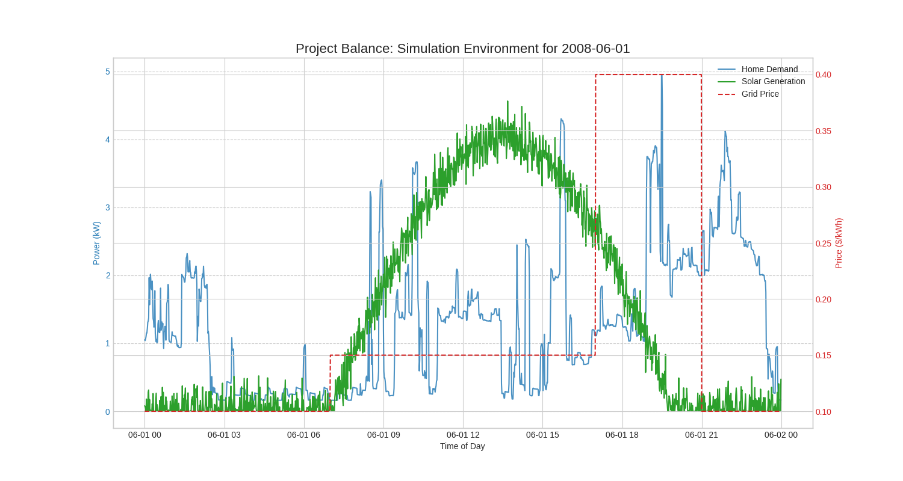

# Project Balance: An AI for Smart Battery Control

**A submission for the IEEE PES & YP Challenge by Mouhib Farhat.**

---

### 1. The Main Idea

So, for this project, we're tackling what I think is the most interesting topic: **Managing Energy Storage**. Our project is called "Project Balance," and the idea is to build an AI that can intelligently control a home battery system.

This isn't just about saving a few bucks. It's about building an AI that can juggle three different goals at once:
- **Save money for the user:** Charge the battery when electricity is cheap (like from solar) and use that stored power when grid electricity is expensive.
- **Help the grid:** Be a good citizen. If the grid is stressed, the AI can discharge the battery to help out.
- **Protect the battery:** A home battery is expensive. The AI needs to be smart enough to avoid wearing it out too quickly.

This is a true decision-making problem, which is a lot more challenging and interesting than just forecasting.

### 2. Phase 1: Building a Realistic Simulation

Getting real-world data for a home with a battery, solar panels, and dynamic pricing is almost impossible. So, as the challenge allows, we decided to **simulate a realistic environment**. This gives us a perfect "sandbox" to train our AI in.

We wrote a script that builds this environment from four layers:
1.  **Real Home Demand:** The energy the house needs, taken from the minute-by-minute [UCI Household Power Consumption dataset](https://archive.ics.uci.edu/ml/datasets/Individual+household+electric+power+consumption).
2.  **Simulated Solar Generation:** A realistic solar power curve that follows the sun but has some randomness to mimic clouds.
3.  **Simulated Prices:** A dynamic price signal where electricity is cheap at night and expensive during the evening peak.
4.  **Simulated Grid Events:** Random "demand response" events that ask the AI to help stabilize the grid.

### 3. The Result: Our Simulation Environment

The plot below is the main result of Phase 1. It shows all the different data signals we generated, interacting over a single simulated day. This proves our simulation environment is working and is ready for an AI agent to learn in.



### 4. How to Reproduce This

1.  **Clone the repository:**
    ```bash
    git clone [your-repo-url]
    cd [your-repo-folder]
    ```

2.  **Install dependencies:**
    ```bash
    pip install pandas numpy matplotlib
    ```

3.  **Run the simulation pipeline:**
    *First, make sure you have the `household_power_consumption.txt` file in the directory.*
    ```bash
    python project_balance_simulation.py
    ```
    This will regenerate the plot above.

### 5. The Road Ahead: Phase 2

This is where it gets really exciting. Our plan for Phase 2 is to use **Reinforcement Learning (RL)**:
- **The Model:** We will build a Deep Q-Network (DQN), a type of RL model that's great for this kind of problem.
- **The Goal:** The AI agent will live in our simulation for thousands of "days," learning from its decisions. It will get rewarded for saving money and helping the grid, and penalized for making bad choices. Over time, it will develop its own optimal strategy for managing the battery.
